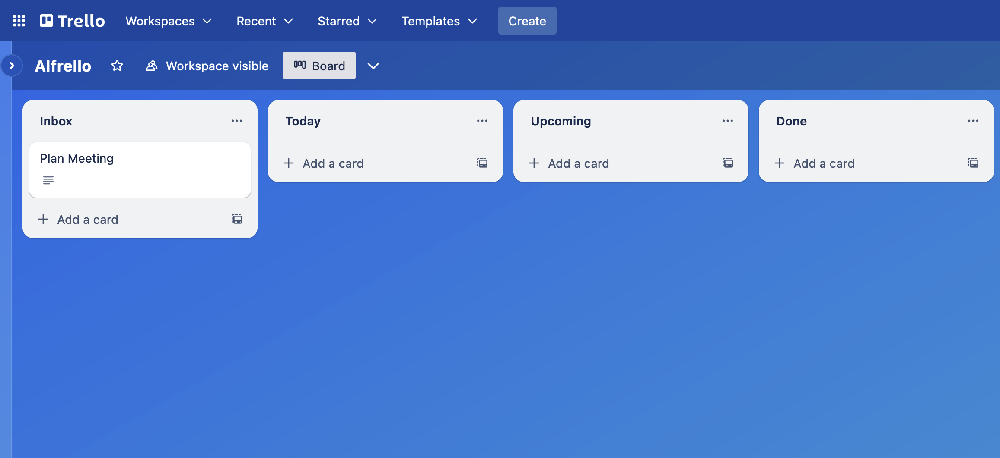
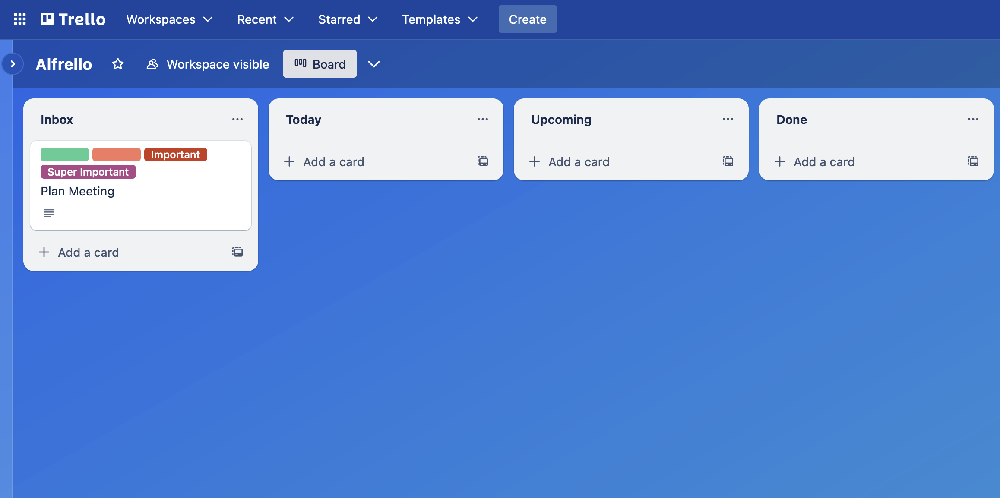
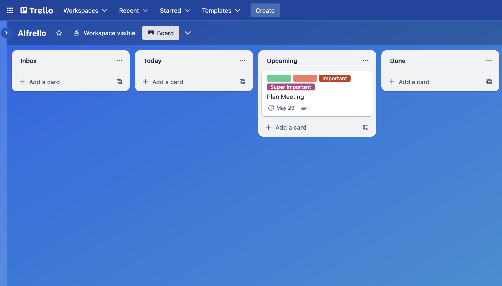
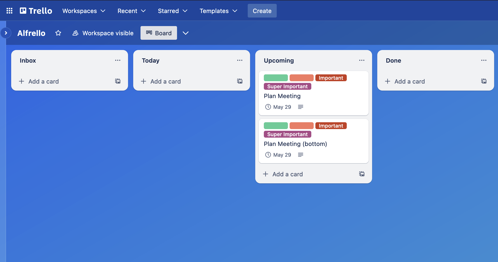
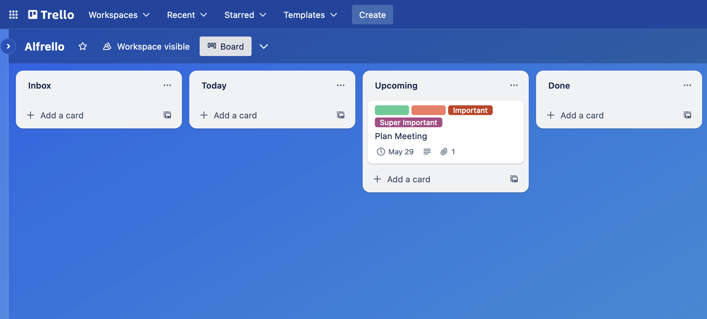
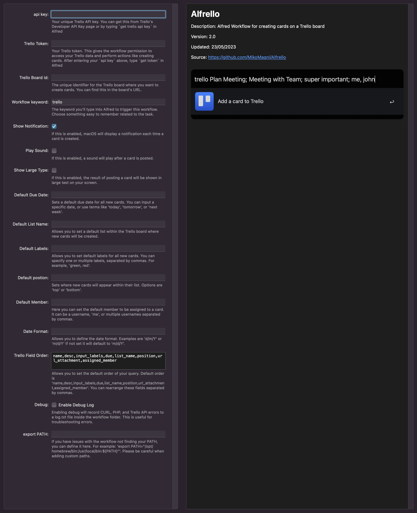

```
  █████╗ ██╗     ███████╗██████╗ ███████╗██╗     ██╗      ██████╗    ██████████╗ 
 ██╔══██╗██║     ██╔════╝██╔══██╗██╔════╝██║     ██║     ██╔═══██╗   ██╔═██╔═██║ 
 ███████║██║     █████╗  ██████╔╝█████╗  ██║     ██║     ██║   ██║   ██║ ██║ ██║ 
 ██╔══██║██║     ██╔══╝  ██╔══██╗██╔══╝  ██║     ██║     ██║   ██║   ██║ ██████║
 ██║  ██║███████╗██║     ██║  ██║███████╗███████╗███████╗╚██████╔╝   ██████████║
 ╚═╝  ╚═╝╚══════╝╚═╝     ╚═╝  ╚═╝╚══════╝╚══════╝╚══════╝ ╚═════╝    ╚═════════╝
```

```
Alfred Workflow for creating cards on a Trello board
```

## What's New
- `NEW` Made for Alfred 5
- `NEW` Support for all Trello Labels and Custom Labels
- `NEW` Assign a card to yourself and or other members
- `NEW` Use natural language for due dates. Use terms like 'today', 'tomorrow', or 'next week'.
- `NEW` Pick your Date format (m/d/Y or d/m/Y)
- `NEW` Personalise the workflow and rearrange all fields based on how you use Trello! 
- `NEW` Use default overwrites so you don't have to type the same fields repeatedly.
- `NEW` All settings are managed within the Workflow configuration 
- `NEW` Enable the Debug Log to see and record helpful error messages into log.txt and your clipboard
- `NEW` Path overwrite

## How To Install

1. Download the latest `Alfrello Workflow` from the [release page](https://github.com/MikoMagni/Alfrello/releases).
2. Double-click on the `Alfrello Workflow` to install it in Alfred

> More information on installing Workflows in Alfred [here](https://www.alfredapp.com/help/workflows/#discovering).

## Alfrello Setup

### Trello API key
-  Type into Alfred `get trello api key` to generate your unique Trello API key.

> More information [here](https://developers.trello.com/docs/api-introduction).  
> Note Make sure to be logged in to Trello in your default browser before generating your API Key.  


-  Copy your unique `Trello API key` to your clipboard

-  Open the `Configure Workflow`


- Paste your `API Key` here:


 
 
 
### Trello Token

-  After entering your `api key`, type `get token` in Alfred to authorise Alfrello to access your Trello data and perform actions like creating cards. 


> More information [here](https://developers.trello.com/docs/api-introduction).<br>


- Copy your `token`

- Open the `Configure Workflow` and paste your `token` here:


### Trello Board id 

Choose the Trello board that you wish to use with Alfrello and copy the `board id`  
You can get the `board id` by simply going to your board and adding `.json` at the end of the URL.  

- Open the `Configure Workflow` and paste your `board id` here:


> For example, go to the Trello development Roadmap Board [https://trello.com/b/nC8QJJoZ/trello-development-roadmap](https://trello.com/b/nC8QJJoZ/trello-development-roadmap).<br> 
> To view the `board id` add .json at the end of the URL [https://trello.com/b/nC8QJJoZ/trello-development-roadmap.json](https://trello.com/b/nC8QJJoZ/trello-development-roadmap.json)<br>
> The Trello development Roadmap board id is `4d5ea62fd76aa1136000000c`


## Usage

### General Usage

1. Launch Alfred App.
2. Enter the workflow keyword that triggers this workflow (The default is `trello`, but you can change it in the `Configure Workflow`).
3. Write the fields you want to specify for your Trello card, separating each field with a semicolon `;`.

The syntax looks like this: `keyword {field1};{field2};{field3};....`

For example, if the keyword is `trello`, a new Trello card with the title "Plan Meeting", description "Meeting with Team", no labels, due tomorrow, in the list "Upcoming", at the top position, with an attachment and assigned to a member, would look like this:

`trello Plan Meeting; Meeting with Team;; tomorrow; Upcoming; top; https://example.com; @username`

> Note that we left the Labels field blank because we don't want to specify any labels.

Spaces between fields and the semicolons are optional. Both keyword `{field1}; {field2}` and keyword `{field1};{field2}` formats will work.

### Available fields

1. `Card Title`: The title of the new card.
2. `Card Description`: The description for the new card.
3. `Labels`: The labels you want to apply to the card. If you want to apply multiple labels, separate them by commas (,) within this field.
4. `Due Date`: The due date for the card. This can be an exact date or a relative date like 'today', 'tomorrow', or 'next week'.
5. `List Name`: The name of the list where you want to add the new card.
6. `Card Position`: Where you want the card to appear within the list. Options are `top` or `bottom`.
7. `Attachment URL`: If you want to attach a URL to the card, add it here.
8. `Assigned Member`: To assign a member to the card, input their username. It can be prefixed with an `@` sign, or you can type the username. You can also use `me` to assign a card to yourself.

### Fields order

In the Alfrello workflow configuration, you have the ability to customise the order of your query fields. This allows you to define a default sequence in which you input your card's data, making the workflow better suit your personal habits or preferences.

By default, the order is set as: 

```
name,desc,input_labels,due,list_name,position,url_attachment,assigned_member
```
 
This represents the Card Title, Card Description, Labels, Due Date, List Name, Card Position, Attachment URL, and Assigned Member.

If you'd prefer to input your data in a different sequence, you can rearrange these fields in the `Trello Field Order` variable in the Workflow configuration. Just make sure that a comma separates each field.


For instance, if you prefer to specify the Assigned Member first, followed by the Card Title, Card Description, and Due Date, you would set the 'Trello Field Order' to: 

```
assigned_member,name,desc,due,input_labels,list_name,position,url_attachment
```

> Please remember that the way you set this order should match how you input the data when you use the Alfred command, as the fields correspond to the positions defined here. So if you set 'assigned_member' as the first field when you input the command in Alfred, the first field after the keyword should be the Assigned Member's username.

By customising the Trello field order, you can further tailor the Alfrello workflow to your needs, boosting your productivity with Alfred and Trello.


### Basic Usage  
 
 **Card Title**
 ---  
 
```
trello Plan Meeting
```  
 
 
 
will create a card on your board on the first list with the title `Plan Meeting`


 
 **Card Description**  
 ---
 
```
trello Plan Meeting; Meeting with Team
```
 

 
will create a card on your board on the first list with the title `Plan Meeting` and description `Meeting with Team`.
 



 
 **Labels**
 ---

- `all` (will add all the available labels)
- `green`
- `yellow`
- `orange`
- `red`
- `purple`
- `blue`
- `sky`
- `lime`
- `pink`
- `black`  
- `Any custom labels by the name`

You can add any number of labels by comma-separating them.
 
```
trello Plan Meeting; Meeting with Team; red, green, important, super important
```


 
will create a card on your board on the first list with the title `Plan Meeting` and description `Meeting with Team` with `red`, `green`, `important` and `super important` labels. 

> `important` and `super important` are custom labels



**Due Date**  
---

The `due date` can be an exact date or a relative date like `today`, `tomorrow`, or `next week`.

You can define the date format in the Workflow configuration. For example, `d/m/Y` or `d/m/Y`.
 
```
trello Plan Meeting; Meeting with Team; red, green, important, super important; next monday
```


will create a card on your board on the first list with the title `Plan Meeting` and description `Meeting with Team` with `red`, `green`, `important` and `super important` labels. The due date will be set as `next monday`.
  


**List Name**  
---
 
```
trello Plan Meeting; Meeting with Team; red, green, important, super important; next monday; Upcoming
```


will create a card on your board on the `Upcoming` list with the title `Plan Meeting` and description `Meeting with Team` with `red`, `green`, `important` and `super important` labels. The due date will be set as `next monday`. 


> Please note: `List names` are case sensitive




**Card Position**
---

Options are `top` or `bottom`.
   
```
trello Plan Meeting (bottom); Meeting with Team; red, green, important, super important; next monday; Upcoming; bottom
```


will create a card on your board on the `Upcoming` list with the title `Plan Meeting (bottom)` and description `Meeting with Team` with `red`, `green`, `important` and `super important` labels. The due date will be set as `next monday`. The card will be created at the `bottom` of the list

> If you don't specify a card position, your new card will automatically be placed at top of the list. 




**URL Attachement**
---

```
trello Plan Meeting; Meeting with Team; red, green, important, super important; next monday; Upcoming; top; https://www.alfredapp.com
```


will create a card on your board on the `Upcoming` list with the title `Plan Meeting (bottom)` and description `Meeting with Team` with `red`, `green`, `important` and `super important` labels. The due date will be set as `next monday`. The card will be created at the `top` of the list and have `https://www.alfredapp.com` attached.




**Assigned Members**
---

To assign a member to the card, input their username. It can be prefixed with an `@` sign or just the username. You can also use `me` to assign a card to yourself.

```
trello Plan Meeting; Meeting with Team; red, green, important, super important; today; Today; top; https://www.alfredapp.com; me
```


will create a card on your board on the `Today` list with the title `Plan Meeting` and description `Meeting with Team` with `red`, `green`, `important` and `super important` labels. The due date will be set as `Today`. The card will be created at the `top` of the list and have `https://www.alfredapp.com` attached. The card will be assigned to me.


In the following example will be creating the same card by assigning it to myself (`me`) and another user (`billgates1955`).


```
trello Plan Meeting; Meeting with Team; red, green, important, super important; today; Today; top; https://www.alfredapp.com; me, billgates1955
```


## Configure Workflow


`api key`: Your unique Trello API key. You can get this from Trello's Developer API Key page.

`trello token`: Your Trello token. This gives the workflow permission to access your Trello data and perform actions like creating cards.

`Trello Board id`: The unique identifier for the Trello board where you want to create cards. You can find this in the board's URL.

`workflow keyword`: The keyword you'll type into Alfred to trigger this workflow. Choose something easy to remember related to the task.

`show notification`: If this is enabled, macOS will display a notification each time a card is created.

`play sound`: If this is enabled, a sound will play after a card is posted.

`show large type`: If this is enabled, the result of posting a card will be shown in large text on your screen.

`default due date`: Sets a default due date for all new cards. You can input a specific date, or use terms like 'today', 'tomorrow', or 'next week'.

`Default list name`: Allows you to set a default list within the Trello board where new cards will be created.

`default labels`: Allows you to set default labels for all new cards. You can specify one or multiple labels, separated by commas. For example, 'green, red'.

`Default position`: Sets where new cards will appear within their list. Options are 'top' or 'bottom'.

`default member`: Here you can set the default member to be assigned to a card. It can be a username, 'me', or multiple usernames separated by commas.

`date format`: Allows you to define the date format. Examples are 'd/m/Y' or 'm/d/Y'.

`Trello field order`: Allows you to set the default order of your query. The default order is `name,desc,input_labels,due,list_name,position,url_attachment,assigned_member`. You can rearrange these fields separated by commas.

`Debug`: Enabling debug will record CURL, PHP, and Trello API errors to a log.txt file inside the workflow folder. This is useful for troubleshooting errors.

`export PATH`: If you have issues with the workflow not finding your PATH, you can define it here. For example: 'export PATH="/opt/homebrew/bin:/usr/local/bin:${PATH}"'. Please be careful when adding custom paths.


 
## License

[MIT](https://github.com/MikoMagni/Trello-Workflow-for-Alfred/blob/master/MIT%20License) © Miko Magni